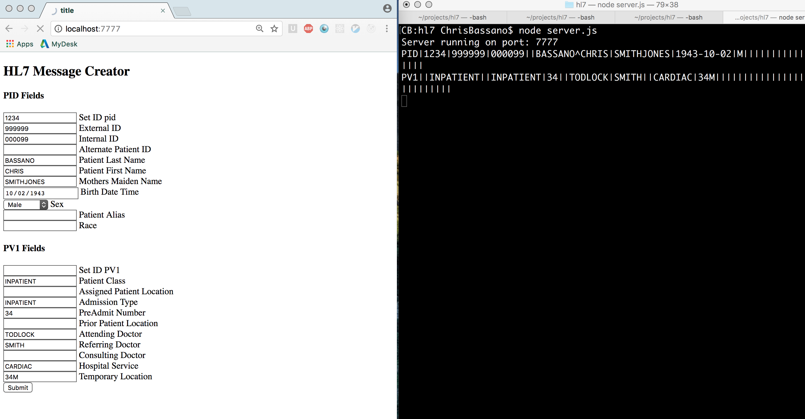

# hl7

## Installation and Dependencies
This repo uses `yarn` as a package manager. [Yarn can be installed using homebrew.](https://yarnpkg.com/en/docs/install)

`yarn install` is used to install all dependencies on a project.

You must have `node`, `yarn`, and `grunt` installed on your computer in order to develop on this repository locally.

## Use
You can run this locally by navigating to the root directory and running the `node server.js` command. Open up your browser to `localhost:7777`. You can enter data into the UI and see the HL7-encoded string returned in your terminal.  

There are default values for some of the fields for demonstration purposes. 

## Testing
Use the command `npm test` to run the test suite. You will be able to see a few HL7 strings produced from within the test suite.

I used TDD using [Mocha](https://mochajs.org/) to develop the back-end logic for the application.

This repo is using [StandardJS](http://standardjs.com/awesome.html) as a linter.

Upon every filechange, the test suite is run and the code is linted automatically using [grunt](http://gruntjs.com/).

## Other Considerations
This repository only formats data into the PID and PV1 sections of HL7 strings. This program does not store data nor is it intended for actual patient care. If we were to store data, we'd need sanitization of inputs and end-to-end encryption.

The patient name segment only has fields for first and last name. Normally this segment follows the [XPN - Extended Patient Name](http://hl7-definition.caristix.com:9010/HL7%20v2.3.1/segment/Default.aspx?version=HL7%20v2.3.1&dataType=XPN) structure which has up to 8 fields. I used only first and last name for simplicity. Because this is the only field I set up for sub-segments, I created a single function called concatName. In a production application, this would be modularized to handle various segments.

This UI is WYSIWYG - anything entered into the UI will be stringified and entered into the HL7 encoded output.

This repo behaves the same regardless of environment (dev, testing, prod, etc.)

##  Possible Improvements
- Lots of front-end validation and UI improvements. Checking input length, type, etc. 
- Sanitization of inputs
- Add more test coverage. I only did basic testing for required fields. There is no end-to-end testing. This testing can be drilled down to each specific segment and sub-segment.
- Visual representation of the HL7 string in the UI
- Auto-capitalization of characters on the back-end
- Automatic pulling of data options from the backend (auto generate the drop-down list for "sex" options rather than hard code options into the html)
